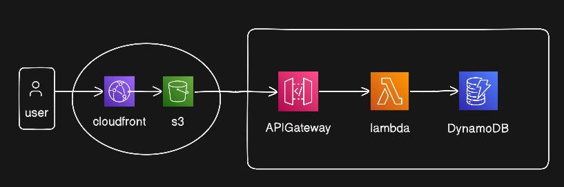

# Serverless Task Manager — Architecture & Deployment Guide



## 🧩 Components Overview

| Component                      | Description                                                                                                                                                                                   |
| ------------------------------ | --------------------------------------------------------------------------------------------------------------------------------------------------------------------------------------------- |
| **Frontend (S3 + CloudFront)** | A vanilla HTML, CSS, and JavaScript interface. Amazon S3 stores the static files (`index.html`, `script.js`), while CloudFront acts as a CDN to deliver them globally, quickly, and securely. |
| **API Gateway**                | Acts as the "front door" for the backend. Routes HTTP requests (GET, POST, PUT, DELETE) from the frontend to the serverless backend.                                                          |
| **AWS Lambda**                 | The serverless compute layer written in Python. Handles business logic, processes incoming API requests, formats data, and interacts with the database.                                       |
| **DynamoDB (TaskTable)**       | A fast, scalable NoSQL database service used to store tasks and their completion status.                                                                                                      |

---

## 🚀 Getting Started

Follow these steps to deploy this architecture into your own AWS account.

### 1. Database Setup: DynamoDB

1. Go to the **DynamoDB Console** in AWS and click **Create table**.
2. Set the **Table name** to `TaskTable`.
3. Set the **Partition key** to `taskId` (Type: `String`).
4. Leave all other settings as default and click **Create table**.

---

### 2. Backend Setup: AWS Lambda

1. Go to the **AWS Lambda Console** and click **Create function**.
2. Choose **Author from scratch**. Name it `TaskManagerFunction` and select **Python 3.x** as the runtime.
3. **Permissions:** Ensure the function's Execution Role has permissions to interact with DynamoDB:
   - Go to **Configuration** → **Permissions** → click the Role name
   - **Add permissions** → **Attach policies**
   - Attach `AmazonDynamoDBFullAccess`, or create an inline policy with: `PutItem`, `GetItem`, `UpdateItem`, `DeleteItem`, and `Scan`
4. Paste your Python backend code into `lambda_function.py` and click **Deploy**.
5. **Testing:** Create a test event in the Lambda console mimicking an API Gateway proxy request to verify it interacts correctly with your `TaskTable`.

---

### 3. Routing Setup: API Gateway

1. Go to the **API Gateway Console** and create a new **REST API**.
2. Create a new Resource named `/tasks`.
3. Under the `/tasks` resource, create methods for `GET`, `POST`, `PUT`, and `DELETE`.
4. For **each method**:
   - Choose **Lambda Function** integration.
   - ⚠️ **CRITICAL:** Check the box for **"Use Lambda Proxy integration"**.
   - Point it to your `TaskManagerFunction`.
5. **Enable CORS:** Click on the `/tasks` resource, select **"Enable CORS"**, check all methods, and click **Save**.
6. Click **Deploy API**, create a new stage (e.g., `prod`), and copy the **Invoke URL**.

---

### 4. Testing with Postman

Before connecting the frontend, verify your API is working using Postman:

| Operation   | Method   | URL                                                                                         |
| ----------- | -------- | ------------------------------------------------------------------------------------------- |
| Create Task | `POST`   | `https://{your-api-id}.execute-api.{region}.amazonaws.com/prod/tasks`                       |
| Read Tasks  | `GET`    | `https://{your-api-id}.execute-api.{region}.amazonaws.com/prod/tasks`                       |
| Update Task | `PUT`    | `https://{your-api-id}.execute-api.{region}.amazonaws.com/prod/tasks?taskId={your-task-id}` |
| Delete Task | `DELETE` | `https://{your-api-id}.execute-api.{region}.amazonaws.com/prod/tasks?taskId={your-task-id}` |

**POST body (raw JSON):**

```json
{ "title": "Buy groceries" }
```

**PUT body (raw JSON):**

```json
{ "completed": true }
```

---

### 5. Connecting the Frontend

1. Open the `script.js` file in your frontend code.
2. Locate the `API_URL` variable at the top of the file.
3. Replace the placeholder with your actual API Gateway Invoke URL from Step 3 (ensure it ends in `/tasks`):

```javascript
const API_URL =
  'https://YOUR_API_ID.execute-api.YOUR_REGION.amazonaws.com/prod/tasks';
```

---

### 6. Deployment: S3 + CloudFront

#### S3

1. Create an S3 bucket (e.g., `my-task-manager-frontend`).
2. Keep **"Block all public access" ON** for security.
3. Upload your updated `index.html` and `script.js` files.

#### CloudFront

1. Create a new **CloudFront Distribution**.
2. Set the **Origin domain** to your S3 bucket.
3. Under **Origin access**, select **Origin access control settings (recommended)** (OAC) and click **Create control setting**.
4. Create the distribution. A yellow banner will appear with an **S3 Bucket Policy** — click **Copy policy**.
5. Go back to your S3 bucket → **Permissions** tab → **Bucket Policy**, click **Edit**, and paste the policy to allow CloudFront to read your files.
6. Grab your **Distribution domain name** (e.g., `d123456abcdef.cloudfront.net`) from the CloudFront console.

Open this URL in your browser to view your live, fully scalable serverless application! 🎉
